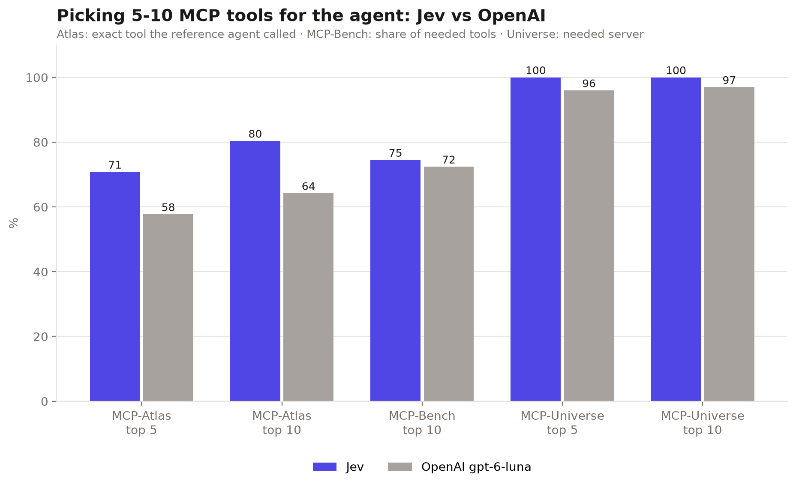
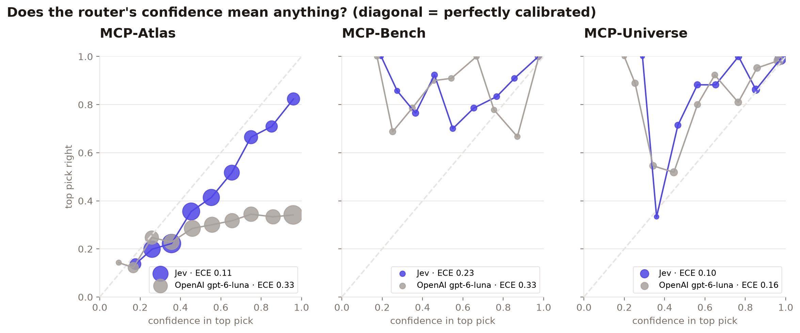

# 01 · Jev as a tool router for MCP agents

A coding agent with 10 MCP servers connected carries 250–300 tool definitions (40–50k tokens) in its context on every turn, and has to pick the right tool out of all of them. Here a **decision model picks the 5 or 10 tools the agent needs next**, and the agent only sees those.

```
 task + progress so far ──▶ decision model ──▶ top-5 / top-10 tools ──▶ agent (Claude etc.) calls one
                           (one /v1/decisions call,                     with ~1–2k tokens of tools
                            a probability for every tool)               instead of ~45k
```

Both decision models get identical questions through a Decisions API: OpenAI's for `gpt-6-luna`, and OpenRouter's (served by TypeSafe) for Jev. Vercel AI Gateway also works for Jev when the team has paid credits:

| | top 5 tools | top 10 tools |
|---|---|---|
| **Jev** (`typesafe-ai/jev`, trained with RLCD) | ✓ | ✓ |
| **OpenAI** (`gpt-6-luna`) | ✓ | ✓ |

That's 4 variations × 3 benchmarks, except MCP-Bench, which is scored at top-10 only. Its tasks need ~9 tools each, so a 5-tool shortlist can't cover them even when it's perfect.

## Results



| Benchmark | Score | Model | top 5 | top 10 | Tool tokens (all → top 10) | Top-1 right | Mean confidence | ECE | p50 latency | $ / 1k decisions |
|---|---|---|---|---|---|---|---|---|---|---|
| MCP-Atlas | right tool in shortlist | Jev | 70.8% | 80.4% | 43,297 → 1,880 | 39.8% | 50.9% | 0.111 | 619 ms | $0.45 |
|  |  | OpenAI gpt-6-luna | 57.7% | 64.2% | 43,297 → 1,703 | 29.6% | 62.1% | 0.325 | 1252 ms | $0.83 |
| MCP-Bench | share of needed tools in shortlist | Jev | — | 74.5% | 50,256 → 1,944 | 85.4% | 62.5% | 0.230 | 1198 ms | $0.19 |
|  |  | OpenAI gpt-6-luna | — | 72.4% | 50,256 → 2,550 | 84.8% | 55.5% | 0.330 | 897 ms | $0.73 |
| MCP-Universe | needed server in shortlist | Jev | 100.0% | 100.0% | 26,465 → 1,734 | 92.5% | 82.7% | 0.099 | 607 ms | $0.18 |
|  |  | OpenAI gpt-6-luna | 96.0% | 97.0% | 26,465 → 1,592 | 82.4% | 66.6% | 0.158 | 245 ms | $0.33 |



**What it shows**
- **Accuracy:** Jev's shortlist contains the right tool more often on all three benchmarks. The biggest gap is on MCP-Atlas, the hardest one (2,060 step-level decisions over 246 tools): 70.8% vs 57.7% at top 5, and 80.4% vs 64.2% at top 10.
- **Calibration:** this is where RLCD shows. On Atlas, when OpenAI's model is ~95% sure, its top pick is right ~34% of the time; Jev's confidence tracks its accuracy (ECE 0.11 vs 0.33).
- **Cost and context:** Jev costs 2–4× less per decision. Either way, the agent reads ~1.7–2.5k tokens of tool definitions per turn instead of 26–50k.
- **Latency:** OpenAI is faster on MCP-Bench and MCP-Universe, and Jev is faster on MCP-Atlas (0.62 s vs 1.25 s median).

**Read the numbers with these caveats**
- **Atlas gold is strict.** A step counts only if the shortlist has the exact tool the reference trajectory used, so an equivalent web-search tool counts as a miss. Absolute numbers are a lower bound, and both models face the same strictness.
- **MCP-Bench has a ceiling.** Tasks need ~9 tools each, so the best possible recall is 90.3% at top 10. Top 5 isn't reported (63.5% ceiling).
- **MCP-Bench and MCP-Universe are small** (103 and 199 decisions), so their calibration curves are noisy.
- **Access routes:** Jev went through OpenRouter's Decisions API, served by TypeSafe (`typesafe/jev-1.13`, snapshot `jev-1.13-20260917`). OpenAI went through OpenAI's Decisions API (`gpt-6-luna`). Vercel AI Gateway was the plan, but it needs paid credits for Jev.
- **The Atlas Jev run** hit OpenRouter's free-credit limit partway. It was completed with `--retry-errors` on further keys, and 25 decisions came from an earlier identical run (details in `results/routing/atlas-20261009-084923/config.json`). Every completed decision requested `typesafe/jev-1.13`, and every one that recorded its snapshot reports `jev-1.13-20260917`.
- **Routing accuracy is not agent accuracy.** Whether the agent then scores as well with 5–10 tools as with all of them is the end-to-end comparison against the published leaderboards, coming next.

Raw per-decision logs: `results/routing/<run>/cases.jsonl`. Rebuild this section with `python -m bench.compare`.

## Benchmarks and what "right" means

| Benchmark | Tasks | Catalog the router chooses from | Gold label per decision |
|---|---|---|---|
| [MCP-Atlas](https://github.com/scaleapi/mcp-atlas) (Scale AI) | 495 of 500 public tasks, 2,060 decisions | 246 tools / 33 servers | the tool the reference trajectory called **at that step** |
| [MCP-Bench](https://github.com/Accenture/mcp-bench) (Accenture) | 103 of 104 tasks | 257 tools / 28 servers | every `Server:tool` the task's dependency plan names; the score is the **share of them in the shortlist** |
| [MCP-Universe](https://github.com/SalesforceAIResearch/MCP-Universe) (Salesforce) | 199 of 232 tasks | 88 tools / 10 servers | the servers the task requires (tasks name servers, not tools) |

The router always sees the **whole catalog**, not the benchmark's per-task subset. That's the realistic "everything connected" setup this idea is about.

Known gaps, reported rather than hidden:
- **MCP-Atlas:** the official list has 307 tools. MongoDB, Slack and Twelve Data (61 tools) won't start without real credentials, so they're missing. The 361 gold steps that need them are skipped and counted in `config.json`.
- **MCP-Universe:** the 33 GitHub tasks are skipped until the GitHub server (Docker) is available.
- **Tool definitions:** these come from each server's `list_tools`, at the pinned versions in `pins/` and the benchmarks' own configs.

## Run it

```bash
./setup.sh                                  # venv + benchmark repos at pinned commits
cp .env.example .env                        # OPENAI_API_KEY, and OPENROUTER_API_KEY + JEVROUTE_JEV_VIA=openrouter (or AI_GATEWAY_API_KEY)
.venv/bin/python -m web.server              # http://127.0.0.1:8790: paste key, press Run per benchmark
```

Or from the CLI (same defaults as the dashboard):

```bash
.venv/bin/python -m bench.routing --benchmark atlas --routers jev,decision:openai/gpt-6-luna --ks 1,5,10
.venv/bin/python -m bench.report results/routing/<run>       # PNG charts + REPORT.md
```

Extra baselines (CLI only): `--routers bm25,embed,llm:anthropic/claude-haiku-4.5`.

## How the router works

`jevroute/routers.py` → `DecisionRouter`:
- **Catalog of 255 tools or fewer** (every catalog here): one `choice` question whose choices are the tools (`value` = tool name, `description` = server + one-line description). The probabilities rank the tools, and top-k is the shortlist.
- **More than 255 tools** (the API's `choice` limit): two stages. First a `predicate` per server ("will the agent need this server?"), all in one request, then a `choice` over the tools of the servers that pass.
- **Per turn:** the router sees the task plus a compressed log of the tool calls so far (`jevroute/policy.py`), and tools already used stay available.

## End-to-end (next step: compare against published leaderboards)

The routing eval checks that the right tools reach the agent. The end-to-end runs check whether the agent then scores as well with 5–10 tools as with all of them, using each benchmark's own harness and judge:

```bash
.venv/bin/python -m bench.e2e atlas    --model anthropic/claude-sonnet-4.5 --profiles full,jev@k5,jev@k10 --num-tasks 20
.venv/bin/python -m bench.e2e mcpbench --model anthropic/claude-sonnet-4.5 --profiles full,jev@k5,jev@k10
.venv/bin/python -m bench.e2e universe --model anthropic/claude-sonnet-4.5 --profiles full,jev@k5 --domains financial_analysis
```

How each benchmark is hooked:
- **MCP-Atlas and MCP-Universe:** the agent's traffic goes through `jevroute/proxy.py`, an OpenAI-compatible proxy that trims the request's `tools` array. The condition rides in the model name (`jev@k5::anthropic/claude-sonnet-4.5`), so no benchmark code changes.
- **MCP-Bench:** its tools are pasted into the planning prompt as text, so `bench/mcpbench_entry.py` patches its planner instead. Its judge stays `o4-mini`, via the Gateway.

These need each benchmark's server keys (see `.env.example`), Docker for MCP-Atlas, and `scripts/setup_*.sh`.

## Layout

```
jevroute/   catalog.py  decide.py (Decisions API client)  routers.py  policy.py  proxy.py  metrics.py
bench/      datasets.py (benchmarks → routing cases)  routing.py  e2e.py  report.py  catalogs.py
            mcpbench_entry.py  universe_entry.py
web/        server.py + static/index.html   (minimal dashboard)
data/catalogs/   tool catalogs for the three benchmarks (committed)
results/    routing/<run>/{config,summary}.json, cases.jsonl, charts/
tests/      .venv/bin/python -m pytest
```
