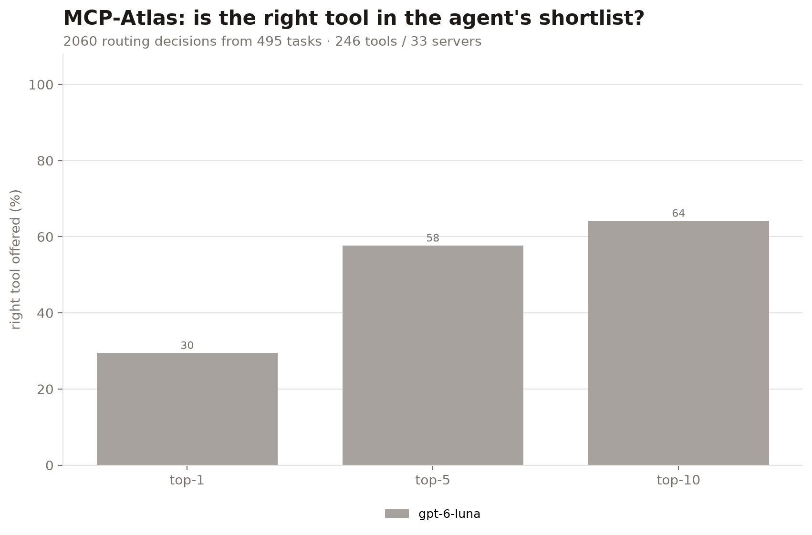
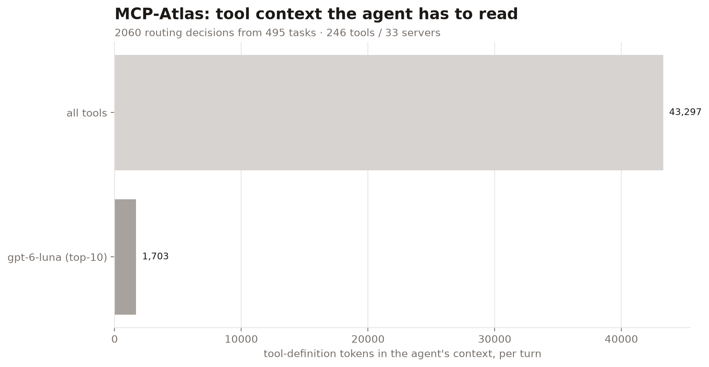
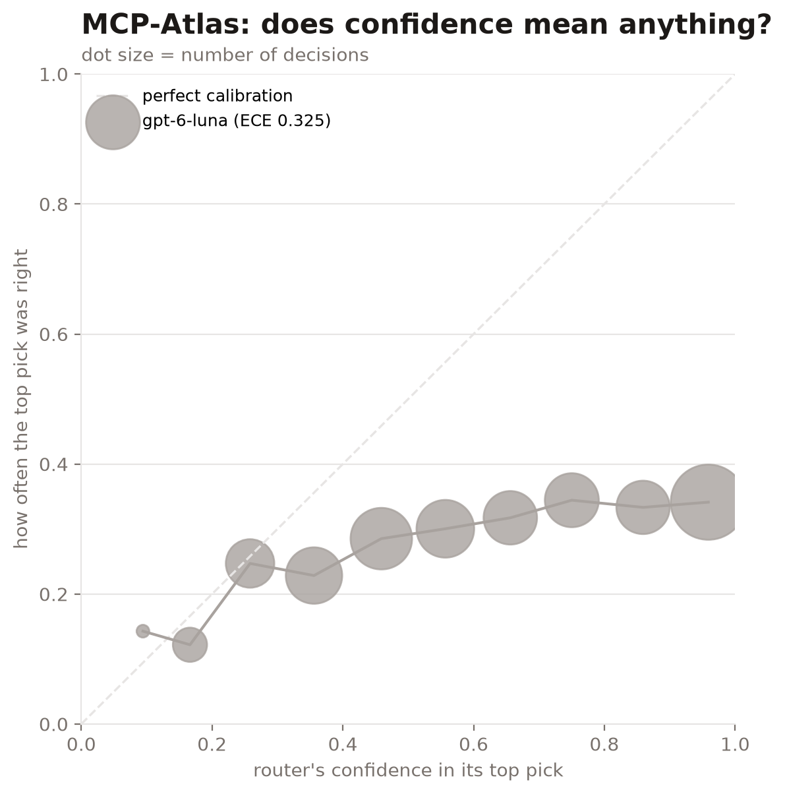
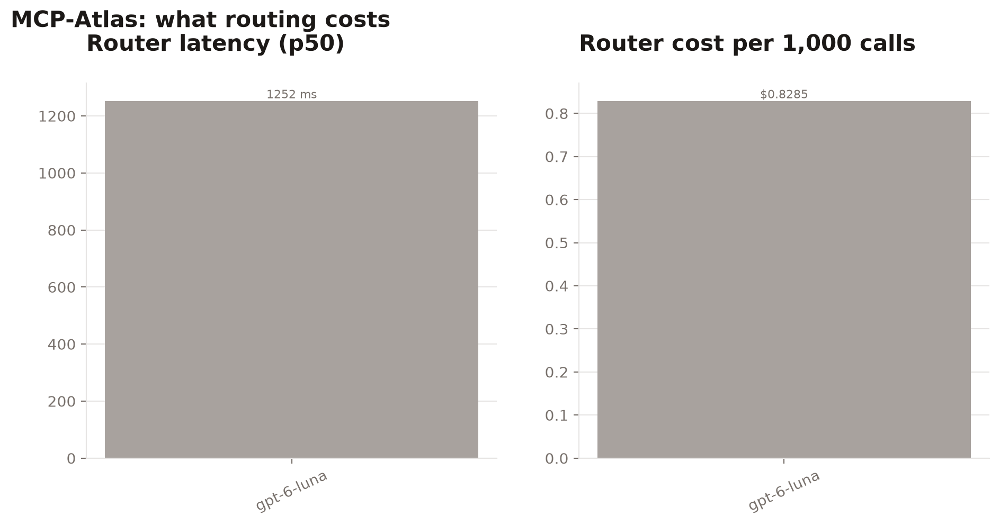

# atlas-20261009-075249

| router | hit@1 | hit@5 | hit@10 | MRR | tool tokens@10 | p50 latency | $/1k calls | ECE |
|---|---|---|---|---|---|---|---|---|
| `gpt-6-luna` | 29.5% | 57.7% | 64.2% | 0.424 | 1,703 | 1252 ms | $0.8285 | 0.325 |

Full catalog: 246 tools, 43,297 tokens of tool definitions. 2060 routing decisions from 495 tasks.

