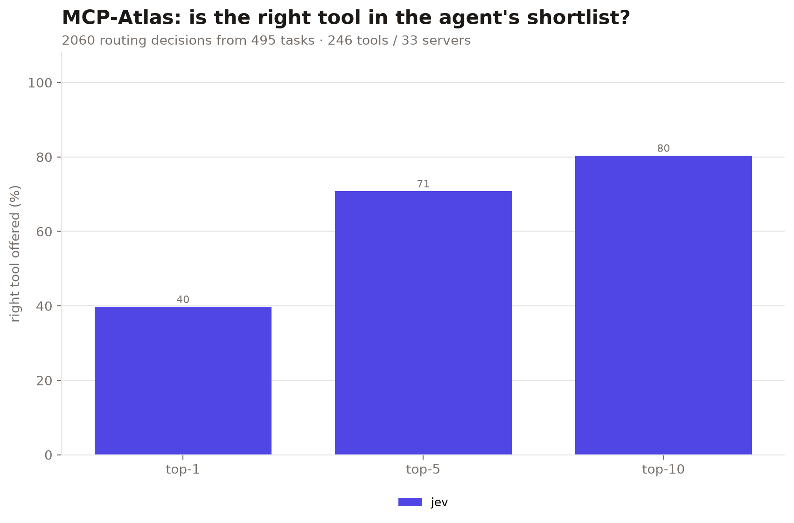
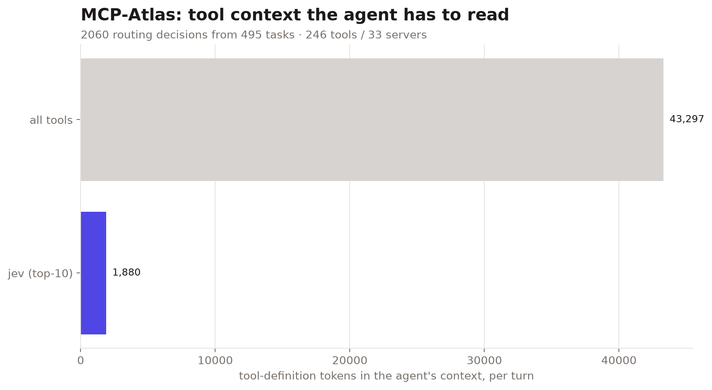
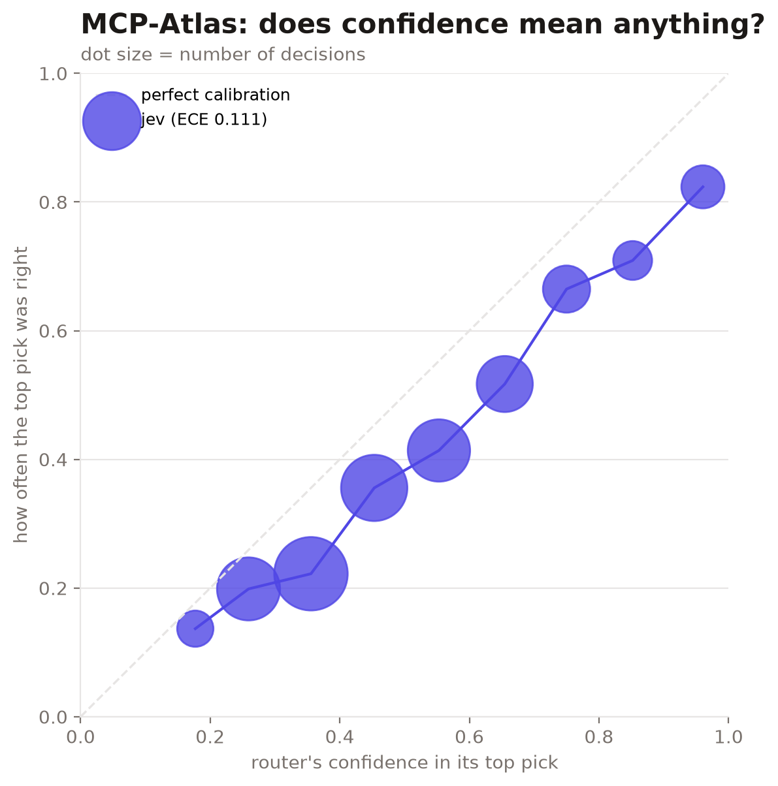
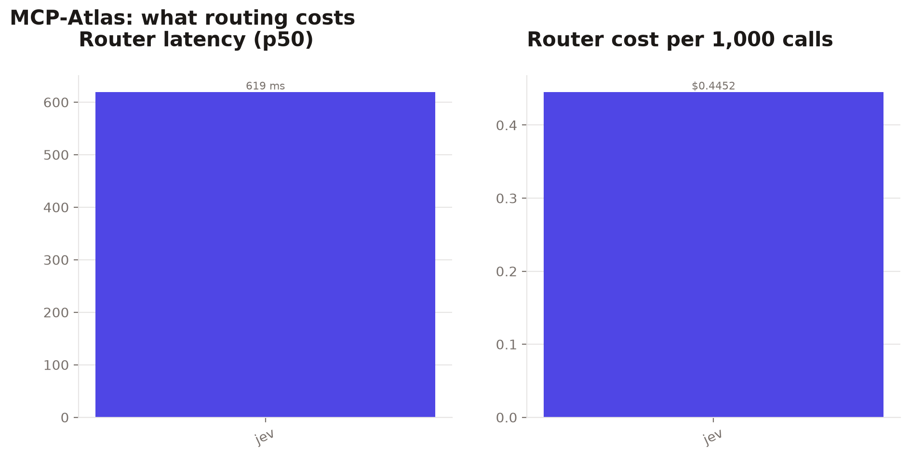

# atlas-20261009-084923

| router | hit@1 | hit@5 | hit@10 | MRR | tool tokens@10 | p50 latency | $/1k calls | ECE |
|---|---|---|---|---|---|---|---|---|
| `jev` | 39.8% | 70.8% | 80.4% | 0.531 | 1,880 | 619 ms | $0.4452 | 0.111 |

Full catalog: 246 tools, 43,297 tokens of tool definitions. 2060 routing decisions from 495 tasks.

