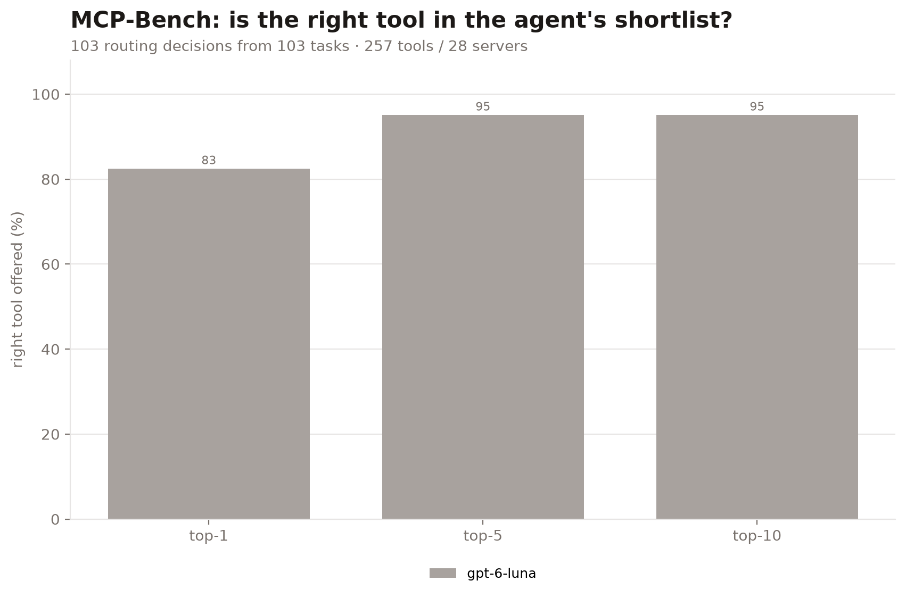
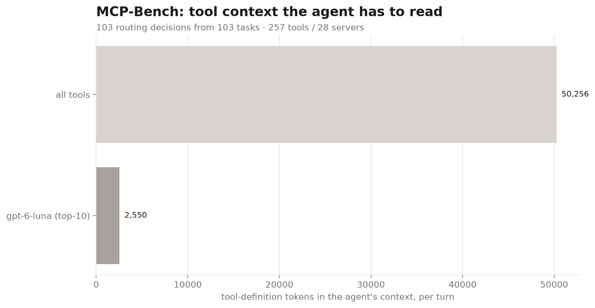
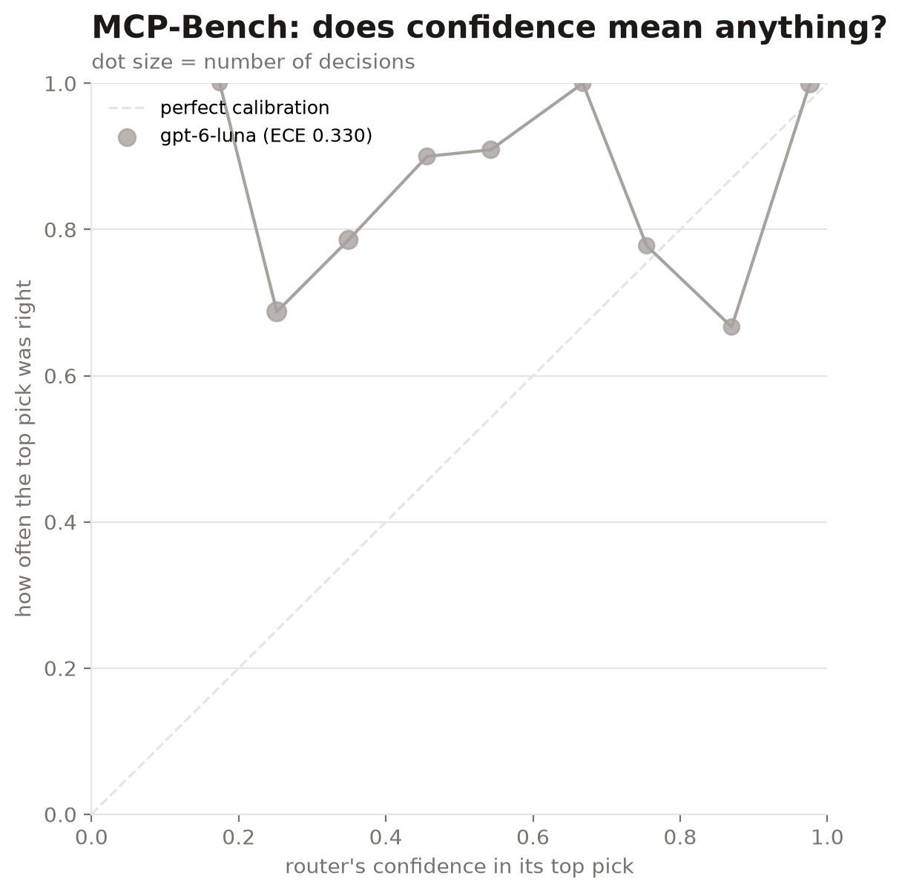
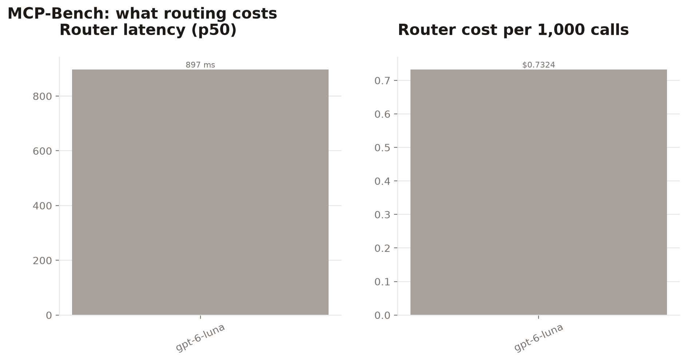

# mcpbench-20261009-075249

| router | hit@1 | hit@5 | hit@10 | MRR | tool tokens@10 | p50 latency | $/1k calls | ECE |
|---|---|---|---|---|---|---|---|---|
| `gpt-6-luna` | 82.5% | 95.1% | 95.1% | 0.882 | 2,550 | 897 ms | $0.7324 | 0.330 |

Full catalog: 257 tools, 50,256 tokens of tool definitions. 103 routing decisions from 103 tasks.

