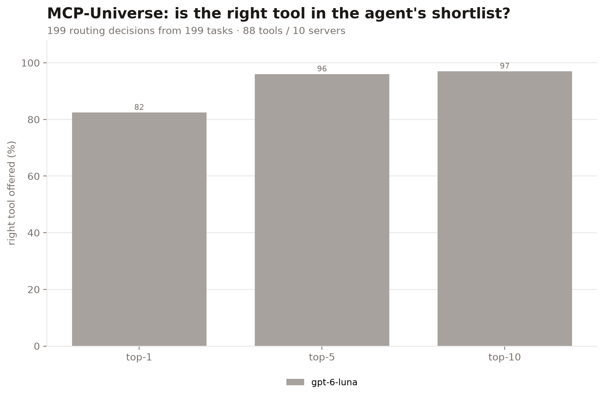
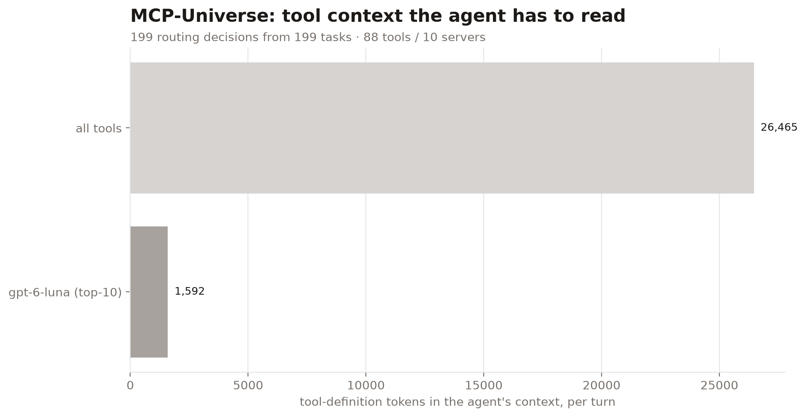
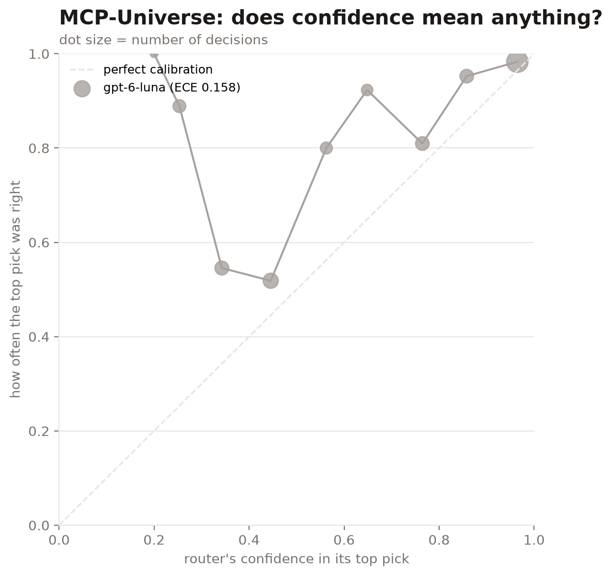
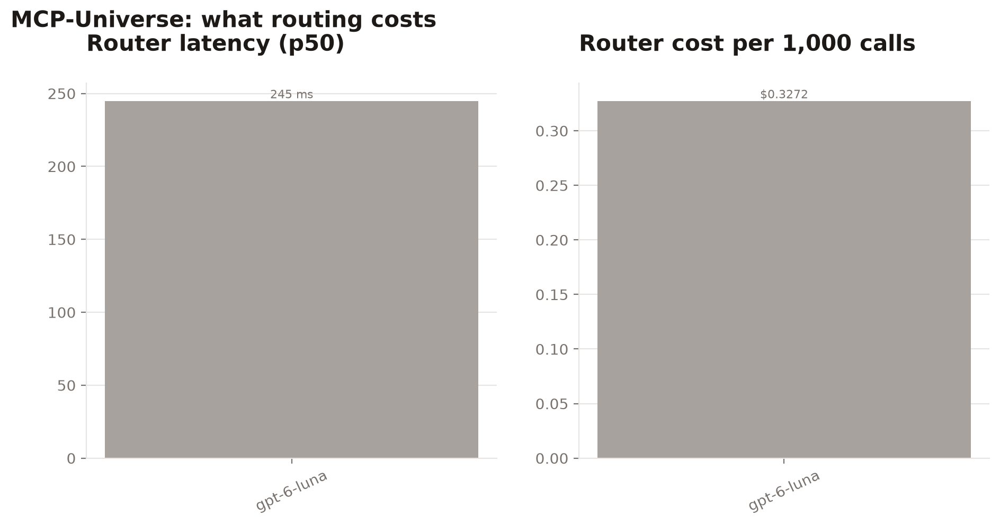

# universe-20261009-075249

| router | hit@1 | hit@5 | hit@10 | MRR | tool tokens@10 | p50 latency | $/1k calls | ECE |
|---|---|---|---|---|---|---|---|---|
| `gpt-6-luna` | 82.4% | 96.0% | 97.0% | 0.884 | 1,592 | 245 ms | $0.3272 | 0.158 |

Full catalog: 88 tools, 26,465 tokens of tool definitions. 199 routing decisions from 199 tasks.

