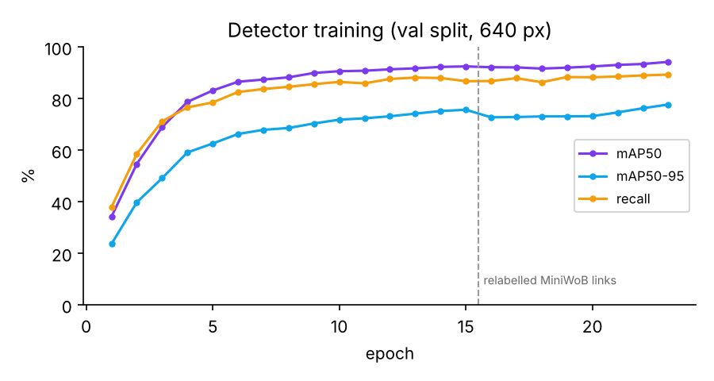
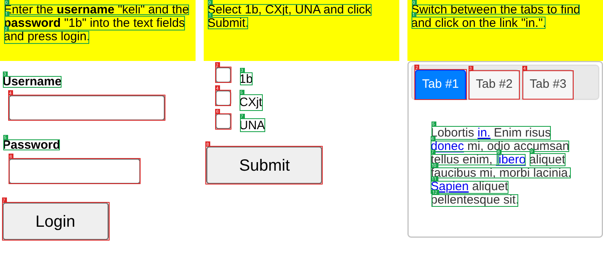

# 02 · Jev as the hands of a screen agent

An agent that controls any screen (browser, desktop or Android phone) from pixels alone, with the work split three ways:

```
                 ┌──────────── what to do ────────────┐   ┌──────── where exactly ─────────┐
 screenshot ──▶  LLM planner (gpt-6-luna)            ──▶  decision model (Jev)          ──▶  click / type / scroll
     │           "type 'alice' into the Username       picks one of the detected          on the device
     │            field"  (words, never coordinates)    elements, with a probability
     └──────▶  YOLO UI detector + OCR ─── 40-150 typed elements ───────▲
               button · link · text_input · checkbox · radio · toggle · dropdown · slider ·
               tab · icon · back · close · menu · search · scrollbar  (+ OCR text runs)
```

- **The LLM plans.** Each turn it sees the screenshot and the history, and names the next action and its target in plain words. It never outputs coordinates.
- **YOLO sees.** A YOLO11n trained here on auto-labelled screenshots finds the interactive elements and their kind. OCR reads their text and attaches nearby labels to fields and checkboxes.
- **Jev picks.** One Decisions API call: a `choice` question whose options are the detected elements (plus "none of these"). The returned probabilities give the pick and a calibrated confidence. If the confidence is low, the agent can tell the planner "not found" instead of clicking the wrong thing.

Compared against the same pipeline with **OpenAI's decision model** (`gpt-6-luna` on OpenAI's Decisions API), against the **chat LLM picking the element itself** (from the same list, or Set-of-Mark style on numbered boxes), and against the **LLM clicking raw coordinates** with no detector.

## Results

### Detector: done (trained here, on CPU)

YOLO11n, fine-tuned from COCO on 4,156 auto-labelled screenshots for 23 epochs: 15, then 8 more after fixing a labelling gap. That took 4.6 h on 4 CPU cores. The weights are `models/screenjev-yolo.pt` (5 MB); metrics are in `models/screenjev-yolo.json`.

| Split | Images | mAP50 | mAP50-95 | Precision | Recall |
|---|---|---|---|---|---|
| Val: synthetic pages + MiniWoB training tasks (640 px) | 368 | **94.2%** | 77.7% | 91.9% | 89.3% |
| Val at 960 px | 368 | **95.4%** | 79.7% | 94.0% | 91.4% |
| **Held-out MiniWoB eval tasks** (25 tasks the detector never saw, 640 px) | 146 | **71.5%** | 52.3% | 90.5% | 60.3% |



Per class (val, mAP50-95): button 90%, text_input 90%, tab 87%, back 86%, toggle 85%, dropdown 84%, icon 79%, slider 76%, menu 75%, scrollbar 73%, search 72%, link 71%, checkbox 70%, close 69%, radio 61%.

On held-out MiniWoB tasks, YOLO + OCR elements (red = detected widget, green = OCR text run):



What it gets right, and where it falls short:
- **Fields, buttons, checkboxes, tabs:** found on unseen task layouts, with labels attached ("text input labeled Username", "checkbox labeled CXjt"). This takes ~0.35 s per screenshot on CPU (YOLO + OCR).
- **Held-out vs val:** the gap (72% vs 94% mAP50) is mostly MiniWoB's own widget styles that only occur in eval tasks. Inline `<span>` links are 33% mAP50-95. Native `<select>` reads as a text input, which still works because `select` picks options by text at that point. Tiny glyph icons that are styled only on hover (social-media's reply / retweet / more) aren't found.
- **Inline links:** when a link isn't boxed, it is still clickable. It sits inside an OCR text run, and the agent clicks the quoted word (`the link "in."`), not the run's center.
- **Image size:** `auto` uses 640 px for phone and MiniWoB-sized screenshots (upscaling them to 960 costs 7 points of mAP50) and 960 px for desktop-sized ones (+1.2 points mAP50 on val).
- **Training length:** the curve is still rising at epoch 23. The GPU notebook (40 epochs at 960 px) should do better on small elements.

### Jev vs gpt-6-luna: not run yet

The ScreenSpot-v2 and MiniWoB++ comparisons need the OpenAI, OpenRouter and Hugging Face APIs, and the container this was built in had no access to them. Everything is wired and tested offline (`SCREENJEV_MOCK=1`). With keys in `.env`:

```bash
python -m bench.screenspot --variants yolo+jev,yolo+luna,yolo+llm,omniparser+jev,omniparser+luna,llm-coords
python -m bench.miniwob --variants yolo+jev,yolo+luna,yolo+llm,yolo+som,dom+jev --episodes 10
python -m bench.report      # tables + charts into results/report/
```


## The detector

No UI-detection dataset was needed: every training screenshot is labelled by the page's own DOM.

- **`bench/synth.py`** generates random UI pages: web layouts (navbars, forms, tables, cards, dialogs, scrolling lists), phone-app screens (app bar with back/search/menu, list rows, bottom tabs, FAB) and desktop-app windows (title bar, menu bar, toolbars). They're styled with Bootstrap, Bulma, Pico or random custom CSS, light and dark, with icons from Bootstrap Icons, Lucide and Material Design Icons, at desktop, tablet and phone viewports. Every interactive element carries `data-ui="<class>"`, so labels are exact. Icons are labelled `back` / `close` / `menu` / `search` by which glyph was drawn.
- **MiniWoB++ pages** add the benchmark's widget style. They are labelled by `screenjev/detect/label.js` heuristics (tag, role, type, aria-label), with random clicks first so opened menus and expanded sections get labelled too. **Every task in the evaluation suite, and its variants, is excluded**, so the detector never sees the eval tasks' layouts.
- `label.js` also finds classic scrollbars (Playwright hides them in headless mode by default; we turn that off) and skips elements hidden behind overlays.

```bash
./scripts/fetch_assets.sh                       # icons, CSS frameworks, fonts (from the npm registry)
python -m bench.make_dataset --synth 3000       # ~4.2k train / 365 val screenshots, ~56k boxes
python -m bench.viz_labels train 20 /tmp/viz    # eyeball the labels
python -m bench.train_detector --device 0 --epochs 40 --imgsz 960 --cache disk   # GPU
python -m bench.train_detector --epochs 30 --imgsz 640                            # CPU (hours)
```

On a GPU in one click: [`notebooks/train_detector_colab.ipynb`](notebooks/train_detector_colab.ipynb) ([open in Colab](https://colab.research.google.com/github/NeelakandanNC/jev-experiments/blob/ccr-79ef4f1c-ef404d/02-jev-screen-control/notebooks/train_detector_colab.ipynb)). It builds the same dataset (same seeds), trains on the T4 and pushes or downloads `models/screenjev-yolo.pt`.

OmniParser v2's detector (Microsoft, YOLOv8, one "interactable" class) plugs in with `--detector omniparser`. The DOM itself is available as an oracle detector, `--detector dom` (browser only), to measure how much the detector's misses cost.

**OCR** is RapidOCR (PP-OCRv4 ONNX, bundled in the wheel, CPU). Its recognizer often drops spaces between English words, so word boundaries come from blank pixel columns in each line, ignoring underlines, plus per-character CTC positions. Words inside a detected box become its text; other words become `text` elements, which are clickable too. Fields, checkboxes, toggles and sliders get the nearest label beside or above them.

## Benchmarks

**ScreenSpot-v2** (grounding, 1,272 instructions on mobile, desktop and web screenshots): is the click inside the target box? This isolates "detector + picker" from planning. Each detector runs once per screenshot, and every picker sees the same element list. Also reported: the share of targets that have any detected element centred inside them (the detector's ceiling), and calibration (ECE, plus accuracy when acting only on the most confident half).

```bash
python -m bench.screenspot --variants yolo+jev,yolo+luna,yolo+llm,omniparser+jev,omniparser+luna,llm-coords
```

**MiniWoB++** (end-to-end, 25 tasks × 10 seeds, a real Chromium): does the agent finish the task? Tasks need only clicks, typing, selection, scrolling and keys (click-button, click-checkboxes, click-tab-2, click-collapsible-2, enter-text-dynamic, login-user, search-engine, social-media, navigate-tree, choose-list, …; see `bench/miniwob_env.py`). The task area is screenshotted at 3× so the 10 px text is readable. Episodes have no time limit, and success means a positive raw reward. The planner is identical across variants.

```bash
python -m bench.miniwob --variants yolo+jev,yolo+luna,yolo+llm,yolo+som,dom+jev --episodes 10
```

| Variant | Planner | Elements | Who picks the element |
|---|---|---|---|
| `yolo+jev` | gpt-6-luna | our YOLO + OCR | **Jev** (Decisions API, `choice`) |
| `yolo+luna` | gpt-6-luna | our YOLO + OCR | OpenAI decision model gpt-6-luna |
| `yolo+llm` | gpt-6-luna | our YOLO + OCR | gpt-6-luna (chat) reads the list, names an id + confidence |
| `yolo+som` | gpt-6-luna | our YOLO + OCR | the planner itself, on numbered boxes (Set-of-Mark), in the same call |
| `dom+jev` | gpt-6-luna | the page's DOM (oracle) | Jev |
| `llm-coords` (ScreenSpot) | — | none | gpt-6-luna outputs x, y |

`python -m bench.report` turns the latest runs into `results/report/REPORT.md` and charts.

## Use it on a real screen

```bash
./setup.sh                      # venv + Chromium (./setup.sh --desktop adds mss + pyautogui)
cp .env.example .env            # OPENAI_API_KEY; OPENROUTER_API_KEY + SCREENJEV_JEV_VIA=openrouter for Jev

.venv/bin/python -m screenjev --device browser --url https://news.ycombinator.com --task "Open the comments of the top story" --show
.venv/bin/python -m screenjev --device desktop --task "Open System Settings and turn on dark mode"
.venv/bin/python -m screenjev --device android --serial emulator-5554 --task "Turn on airplane mode"
```

Options: `--planner` (any OpenAI model, or `provider/model` via the gateway), `--selector jev|luna|llm|som|decision:<model>`, `--detector yolo|omniparser|dom`, `--min-confidence 0.3` (below it, report "not found" to the planner instead of clicking). Every run writes `runs/<time>/index.html`: each step's screenshot with the detected boxes, the pick, the top candidates' probabilities and the outcome.

Desktop control moves your real mouse (slam it into a screen corner to abort, pyautogui's failsafe). Android needs `adb` with USB debugging on.

## Layout

```
screenjev/  devices/{browser,desktop,android}.py   one async Device interface, screenshot-pixel coordinates
            detect/{yolo,ocr,dom}.py, label.js     detectors, OCR, DOM labeller; __init__.py merges them into elements
            planner.py  selector.py  agent.py      LLM plan → decision-model pick → act
            decide.py (Decisions API client, from experiment 01)  llm.py (OpenAI SDK chat)  trace.py
bench/      synth.py  make_dataset.py  train_detector.py  viz_labels.py     detector data + training
            miniwob_env.py  miniwob.py  screenspot.py  report.py            benchmarks
models/     screenjev-yolo.pt (+ .json metrics)    the trained detector (committed, 5 MB)
results/    miniwob/<run>/  screenspot/<run>/  report/
tests/      .venv/bin/python -m pytest   (offline: SCREENJEV_MOCK=1 stand-ins, never reported)
```

Licences: the detector is trained with Ultralytics (AGPL-3.0), and so are its weights. OmniParser's weights are AGPL too.
