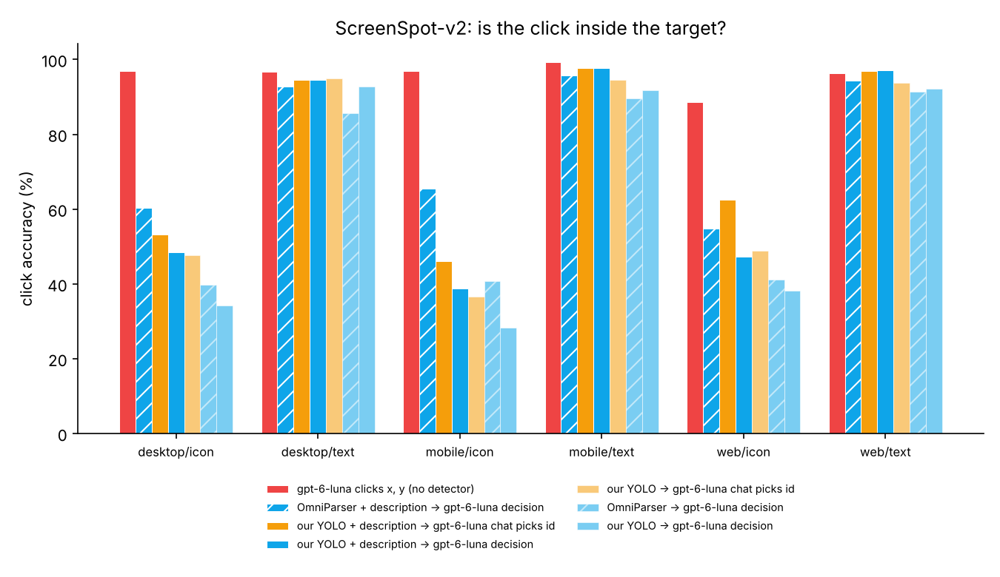
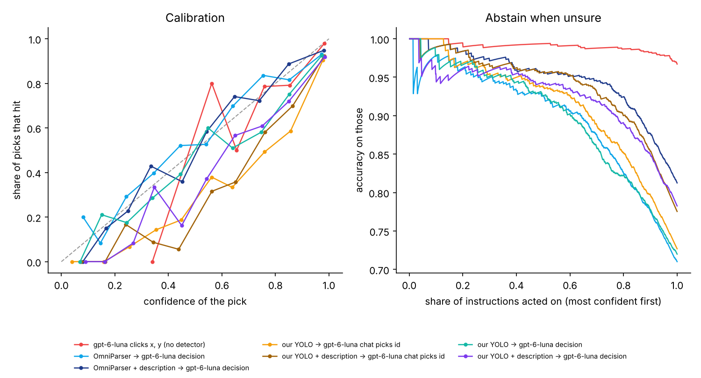
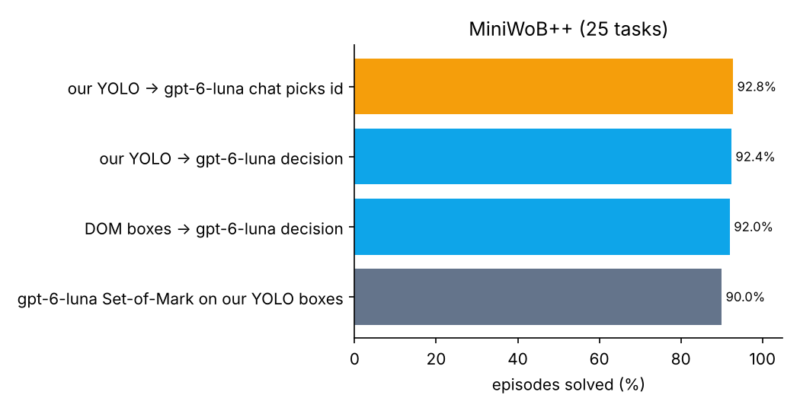

## Results

### Detector (`models/screenjev-yolo.pt`)

YOLO11n fine-tuned from COCO for 23 epochs at 640 px on cpu (4.63 h; 15 + 8 epochs: first dataset (MiniWoB  links unlabelled); then relabelled MiniWoB pages (pointer-cursor elements)). Train set: 4156 screenshots.

| Eval image size | Split | mAP50 | mAP50-95 | Precision | Recall |
|---|---|---|---|---|---|
| 640 | val | 94.2% | 77.7% | 91.9% | 89.3% |
| 640 | miniwob_suite | 71.5% | 52.3% | 90.5% | 60.3% |
| 960 | val | 95.4% | 79.7% | 94.0% | 91.4% |
| 960 | miniwob_suite | 64.2% | 39.6% | 75.4% | 59.6% |

Per-class mAP50-95 (val): button 89.6%, link 70.6%, text_input 89.8%, checkbox 70.0%, radio 60.9%, toggle 85.0%, dropdown 84.1%, slider 76.1%, tab 86.7%, icon 78.6%, back 85.9%, close 68.5%, menu 75.0%, search 71.6%, scrollbar 73.4%

### ScreenSpot-v2 grounding (`results/screenspot/openai-full`)

| Variant | n | Accuracy | desktop/icon | desktop/text | mobile/icon | mobile/text | web/icon | web/text | Detector ceiling | Mean conf. | ECE | Acc. @ top-50% conf. | p50 latency | Tokens / instruction |
|---|---|---|---|---|---|---|---|---|---|---|---|---|---|---|
| gpt-6-luna clicks x, y (no detector) | 942 | **96.7%** | 96.8% | 96.7% | 96.9% | 99.2% | 88.6% | 96.3% | — | 97.2% | 0.008 | 99.4% | 1823 ms | 1,650 |
| OmniParser + description → gpt-6-luna decision | 933 | **80.8%** | 60.3% | 92.8% | 65.4% | 95.7% | 54.8% | 94.3% | 95.8% | 82.9% | 0.038 | 95.7% | 599 ms | 2,889 |
| our YOLO + description → gpt-6-luna chat picks id | 926 | **77.5%** | 53.2% | 94.4% | 46.1% | 97.7% | 62.5% | 97.0% | 82.6% | 87.4% | 0.099 | 95.7% | 1403 ms | 2,698 |
| our YOLO + description → gpt-6-luna decision | 930 | **74.3%** | 48.4% | 94.4% | 38.7% | 97.7% | 47.2% | 97.1% | 82.7% | 87.2% | 0.090 | 94.3% | 184 ms | 2,690 |
| our YOLO → gpt-6-luna chat picks id | 948 | **72.7%** | 47.6% | 95.0% | 36.6% | 94.6% | 48.8% | 93.7% | 82.8% | 85.8% | 0.131 | 93.7% | 1923 ms | 943 |
| OmniParser → gpt-6-luna decision | 956 | **68.4%** | 39.7% | 85.6% | 40.8% | 89.5% | 41.2% | 91.4% | 95.9% | 71.7% | 0.049 | 92.6% | 343 ms | 1,079 |
| our YOLO → gpt-6-luna decision | 955 | **67.0%** | 34.1% | 92.8% | 28.3% | 91.9% | 38.1% | 92.2% | 82.8% | 77.8% | 0.069 | 92.6% | 353 ms | 902 |

### MiniWoB++ end-to-end (`results/miniwob/openai-v1`)

| Variant | Episodes | Success | Task-macro success | Steps / episode | Not-found / episode | Grounding latency | Planner tokens / episode |
|---|---|---|---|---|---|---|---|
| our YOLO → gpt-6-luna chat picks id | 250 | **92.8%** | 92.8% | 2.7 | 0.50 | 1450 ms | 2657 |
| our YOLO → gpt-6-luna decision | 250 | **92.4%** | 92.4% | 2.8 | 0.48 | 201 ms | 2746 |
| DOM boxes → gpt-6-luna decision | 250 | **92.0%** | 92.0% | 2.8 | 0.68 | 204 ms | 2795 |
| gpt-6-luna Set-of-Mark on our YOLO boxes | 250 | **90.0%** | 90.0% | 2.9 | 0.31 | — | 3625 |

Per task

| Task | our YOLO → gpt-6-luna chat picks id | our YOLO → gpt-6-luna decision | DOM boxes → gpt-6-luna decision | gpt-6-luna Set-of-Mark on our YOLO boxes |
|---|---|---|---|---|
| choose-list | 100.0% | 100.0% | 100.0% | 100.0% |
| click-button | 100.0% | 100.0% | 100.0% | 100.0% |
| click-button-sequence | 100.0% | 100.0% | 90.0% | 90.0% |
| click-checkboxes | 100.0% | 100.0% | 100.0% | 100.0% |
| click-checkboxes-soft | 90.0% | 90.0% | 100.0% | 100.0% |
| click-collapsible | 100.0% | 100.0% | 100.0% | 100.0% |
| click-collapsible-2 | 100.0% | 100.0% | 100.0% | 70.0% |
| click-dialog | 100.0% | 100.0% | 100.0% | 100.0% |
| click-dialog-2 | 90.0% | 90.0% | 100.0% | 90.0% |
| click-link | 100.0% | 100.0% | 100.0% | 100.0% |
| click-option | 100.0% | 100.0% | 100.0% | 100.0% |
| click-scroll-list | 50.0% | 50.0% | 30.0% | 50.0% |
| click-tab | 100.0% | 100.0% | 100.0% | 100.0% |
| click-tab-2 | 100.0% | 100.0% | 100.0% | 60.0% |
| click-test-2 | 100.0% | 100.0% | 90.0% | 100.0% |
| click-widget | 100.0% | 100.0% | 100.0% | 100.0% |
| enter-password | 100.0% | 100.0% | 100.0% | 100.0% |
| enter-text | 100.0% | 100.0% | 100.0% | 100.0% |
| enter-text-dynamic | 100.0% | 100.0% | 100.0% | 100.0% |
| focus-text-2 | 100.0% | 100.0% | 100.0% | 100.0% |
| login-user | 100.0% | 100.0% | 100.0% | 100.0% |
| multi-layouts | 90.0% | 90.0% | 90.0% | 90.0% |
| navigate-tree | 100.0% | 100.0% | 100.0% | 100.0% |
| search-engine | 100.0% | 90.0% | 100.0% | 100.0% |
| social-media | 0.0% | 0.0% | 0.0% | 0.0% |

